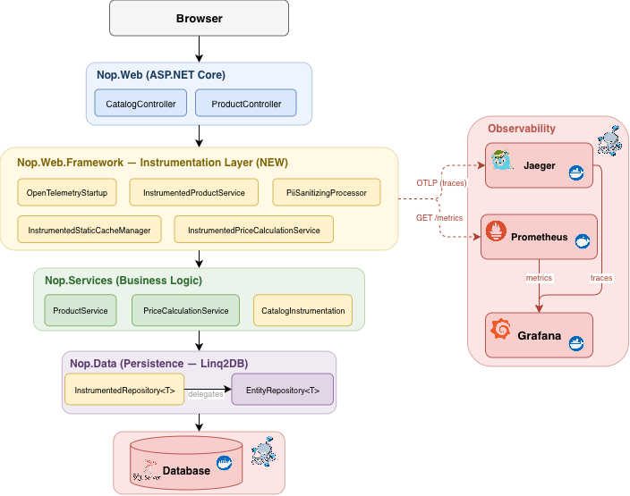
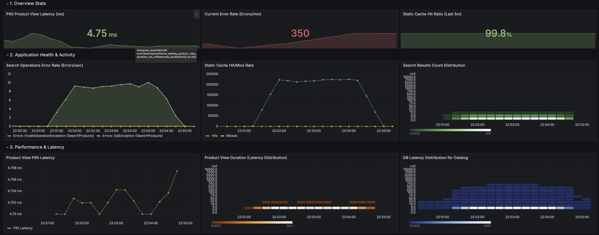
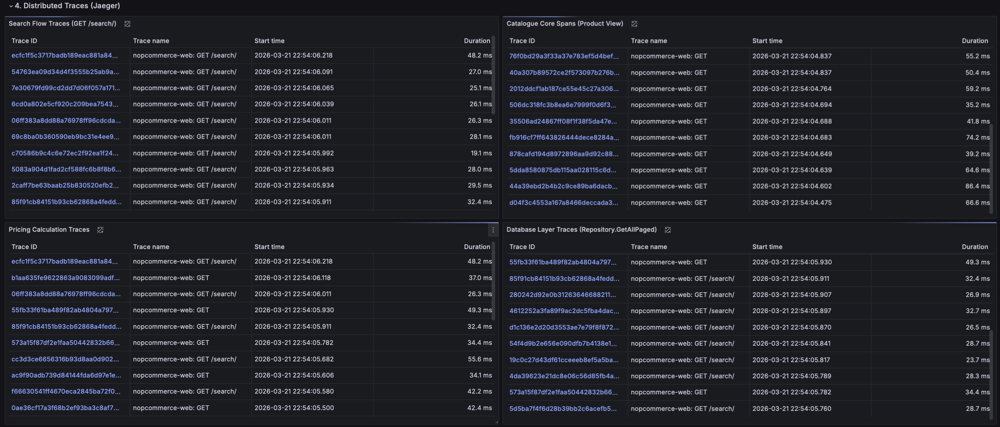
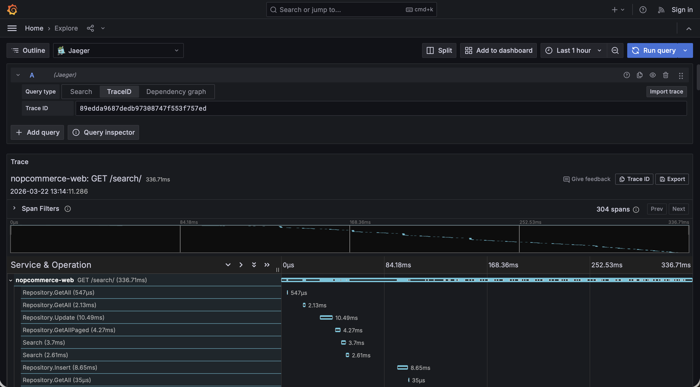
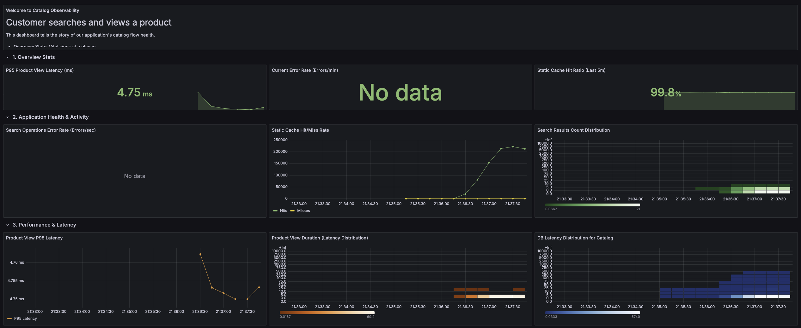
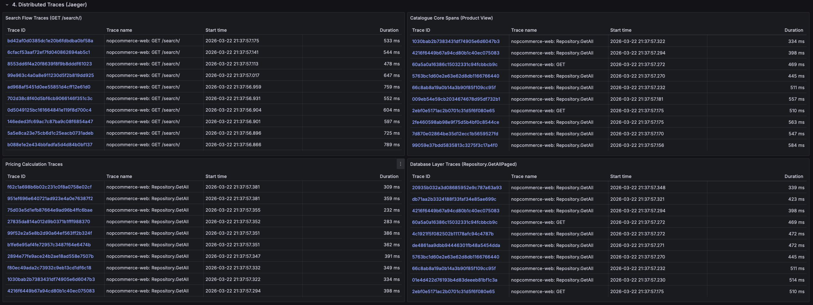
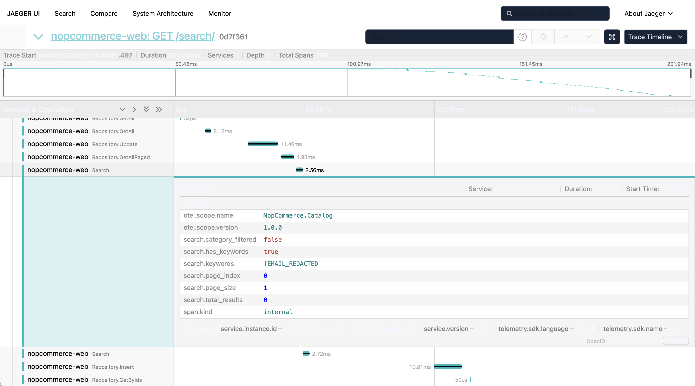

# nopCommerce — Catalog Flow Observability

**Assignment 01 — Observability in the Wild** | Software Architecture, 2024/2025

## About

[nopCommerce](https://github.com/nopSolutions/nopCommerce) is an open-source e-commerce platform built with ASP.NET Core, following a layered architecture: `Nop.Core` (domain), `Nop.Data` (persistence via Linq2DB), `Nop.Services` (business logic), and `Nop.Web` (presentation). It uses SQL Server as its database and a static in-memory cache for performance.

This project adds **end-to-end observability** to nopCommerce using OpenTelemetry, with distributed tracing (exported to Jaeger) and custom metrics (scraped by Prometheus), visualised in a Grafana dashboard.

### Chosen Flow: Customer searches and views a product

The instrumented flow covers three service layers:

- **Search** — the customer types a query in the search bar, which triggers `ProductService.SearchProductsAsync()` to query the database and return matching products
- **Catalogue** — the customer clicks on a product from the results, which triggers `ProductService.GetProductByIdAsync()` to load the full product details
- **Pricing** — while rendering the product page, `PriceCalculationService.GetFinalPriceAsync()` computes the displayed price (applying discounts, tier prices, etc.)

This flow was chosen because it exercises all architectural layers (HTTP → Services → Cache → Database) and is the most common user journey in any e-commerce platform.

---

## Architecture Analysis

### 1. How are the layers organised and what are the dependency rules?

The `src/` directory is organised into four architectural layers:

```
src/
├── Libraries/
│   ├── Nop.Core        ← Domain model + contracts (zero project dependencies)
│   ├── Nop.Data        ← Persistence via Linq2DB (depends on Nop.Core)
│   └── Nop.Services    ← Business logic (depends on Nop.Core + Nop.Data)
├── Presentation/
│   ├── Nop.Web.Framework  ← Shared web infrastructure (depends on all Libraries)
│   └── Nop.Web            ← ASP.NET Core MVC host (depends on everything)
└── Plugins/            ← 31 modular extensions
```

The dependency graph is **strictly acyclic and top-down** (verified via `.csproj` ProjectReferences):

| Project | References |
|---------|-----------|
| **Nop.Core** | None |
| **Nop.Data** | Nop.Core |
| **Nop.Services** | Nop.Core, Nop.Data |
| **Nop.Web.Framework** | Nop.Core, Nop.Data, Nop.Services |
| **Nop.Web** | All four lower-level projects |

Communication between layers happens through three mechanisms:
1. **Constructor injection (DI)** — the primary mechanism. `NopStartup.cs` (334 lines, `Order = 2000`) registers all interface-to-implementation bindings.
2. **Event system** — `IEventPublisher` / `IConsumer<T>` for decoupled cross-layer communication (see below).
3. **Service Locator** — `EngineContext.Current.Resolve<T>()` where constructor injection is impractical (e.g., static extension methods, middleware configuration).

### 2. What is `IEventPublisher` and how is it used?

nopCommerce implements a **synchronous, in-process Publish/Subscribe pattern** for internal events.

```csharp
// Nop.Core/Events/IEventPublisher.cs
public partial interface IEventPublisher
{
    Task PublishAsync<TEvent>(TEvent @event);
}

// Nop.Services/Events/IConsumer.cs
public partial interface IConsumer<T>
{
    Task HandleEventAsync(T eventMessage);
}
```

The `IEventPublisher` interface lives in `Nop.Core` (accessible to all layers). The concrete `EventPublisher` lives in `Nop.Services` and is registered as a singleton.

**Where events are published:**
- **Data layer** (`EntityRepository.cs`) — automatically publishes `EntityInsertedAsync`, `EntityUpdatedAsync`, and `EntityDeletedAsync` after every CRUD operation (lines 349, 402, 452).
- **Service layer** — publishes business events like `OrderPaidEvent`, `CustomerLoggedInEvent`.

**How consumers are discovered:**
All `IConsumer<T>` implementations across the solution (including plugins) are automatically discovered and registered during startup via `ITypeFinder` in `NopStartup.cs:305-312`.

**Primary use case — cache invalidation:** There are **100+ `CacheEventConsumer` classes** in `Nop.Services/`, each subscribing to entity lifecycle events to clear relevant cache entries (e.g., `ProductCacheEventConsumer`, `CategoryCacheEventConsumer`). This decouples cache management from business logic.

### 3. Where is observability easy vs. hard?

**Where it is easy:**
- **DI-based service registration** — every service is behind an interface (`IProductService`, `IRepository<T>`, `IStaticCacheManager`), enabling decorator/subclass-based instrumentation without modifying the original classes.
- **`virtual` methods on services** — `ProductService.SearchProductsAsync()` and `GetProductByIdAsync()` are `virtual`, allowing subclass overrides that add tracing before delegating to `base`.
- **`INopStartup` extension point** — the startup discovery mechanism (`ITypeFinder.FindClassesOfType<INopStartup>()`) allows an observability module to register middleware, override service registrations, and configure telemetry pipelines from a new startup class with a higher `Order` value.
- **`partial class` pattern** — every entity and service is declared `partial`, enabling extension without modifying original files.

**Where it is hard:**
- **Linq2DB has no diagnostic events** — unlike EF Core, Linq2DB does not emit `DiagnosticSource` events. Database queries are invisible to standard tracing tools, requiring a manual decorator around `IRepository<T>`.
- **Custom `ILogger` is not `Microsoft.Extensions.Logging.ILogger`** — nopCommerce defines its own database-backed logger (`Nop.Services.Logging.ILogger`). Standard .NET logging integrations (Serilog, OpenTelemetry LogExporter) do not capture application logs.
- **No existing telemetry infrastructure** — zero `ActivitySource`, `DiagnosticSource`, or `OpenTelemetry` references in the original codebase. Everything was built from scratch.
- **Event system limitations** — `IEventPublisher` only fires "after" events (no "before" events for timing) and only covers write operations, not reads like searches or product views.

### 4. What structural changes would be needed, and are they worth it?

| Change | Effort | Impact | Modifies Core? |
|--------|--------|--------|----------------|
| OpenTelemetry middleware via `INopStartup` | Very low | High — HTTP tracing out of the box | No |
| `IRepository<T>` decorator for DB tracing | Low | High — all SQL operations visible | 1 file (DI registration) |
| Service subclassing for catalog spans | Low | High — Search, Catalogue, Pricing spans | No (new files only) |
| Cache decorator for hit/miss metrics | Low | Medium — cache effectiveness visibility | No (DI replacement) |
| Bridge custom `ILogger` to `Microsoft.Extensions.Logging` | Low | High — structured logs with correlation | No |
| Extend event system with read events | Medium | Medium — instrumentation via consumers | Yes |
| Replace Service Locator with constructor injection | High | Low — indirect observability benefit | Yes |

We implemented the first four changes. The key insight is that nopCommerce's DI and `INopStartup` patterns allow significant observability improvements with **minimal changes to original code** — the same extension mechanism used for plugins works for instrumentation.

---

## Architecture Diagram



The diagram shows the instrumented flow from top to bottom:

1. **Browser / k6** sends HTTP requests (`GET /search?q=...`, `GET /product-slug`) to the application.
2. **Nop.Web** — the ASP.NET Core presentation layer. `CatalogController` handles search requests and `ProductController` handles product detail pages. HTTP spans are auto-instrumented by the OpenTelemetry ASP.NET Core library.
3. **Nop.Web.Framework** — the instrumentation layer (all **new** files, shown in yellow). `OpenTelemetryStartup` configures the OpenTelemetry SDK and replaces original service registrations with instrumented versions. `InstrumentedProductService` creates `Search` and `Catalogue` spans. `InstrumentedPriceCalculationService` creates the `Pricing` span. `InstrumentedStaticCacheManager` records `cache.hits` and `cache.misses` counters. `PiiSanitizingProcessor` redacts sensitive data (emails, tokens, payment details) from all spans before export.
4. **Nop.Services** — the business logic layer. `ProductService` and `PriceCalculationService` are the original base classes with `virtual` methods that our instrumented subclasses override. `CatalogInstrumentation` defines the shared `ActivitySource` ("NopCommerce.Catalog") and `Meter` used by all catalog instrumentation.
5. **Nop.Data** — the persistence layer using Linq2DB. `InstrumentedRepository<T>` is a decorator (new) that wraps `EntityRepository<T>` (original), adding `Repository.*` spans and recording `database.query_duration_ms` for every database operation.
6. **Database** — SQL Server 2019, running in Docker.

**Telemetry export** (right side): traces are sent via OTLP gRPC to **Jaeger**, and metrics are scraped via `GET /metrics` by **Prometheus**. Both feed into **Grafana** for unified visualisation.

---

## Prerequisites

- [.NET 9 SDK](https://dotnet.microsoft.com/en-us/download)
- [Docker](https://docs.docker.com/engine/install/)
- [Docker Compose](https://docs.docker.com/compose/install/)
- [k6](https://grafana.com/docs/k6/latest/set-up/install-k6/)

---

## Quick Start

### 0. Clone the Repository

```bash
git clone https://github.com/JorgeGuiDomingues/nopCommerce.git
cd nopCommerce
```

### 1. Start All Infrastructure (Database + Observability)

```bash
docker compose -f docker-compose.yml -f docker-compose.observability.yml up -d
```

This starts everything in one command:
| Service          | URL / Port                 | Purpose                       |
|------------------|----------------------------|-------------------------------|
| **SQL Server**   | localhost:1433              | Database (SQL Server 2019 Express) |
| **Jaeger**       | http://localhost:16686      | Distributed traces UI         |
| **Prometheus**   | http://localhost:9090       | Metrics storage               |
| **Grafana**      | http://localhost:3000       | Dashboards (admin/admin)      |

### 2. Build and Run nopCommerce

The application is run **locally** (not inside Docker) to avoid networking issues between containers. Running locally, the app connects to SQL Server on `localhost:1433` and exports traces to Jaeger on `localhost:4317` without needing to reconfigure service hostnames. The existing `docker-compose.yml` includes a `nopcommerce_web` service, but it exposes port 80 (not 5050) and would require adjusting the database and OTLP connection strings for inter-container networking.

```bash
cd src
dotnet restore Nop.sln
dotnet run --project Presentation/Nop.Web/Nop.Web.csproj
```

The application starts at **http://localhost:5050**.

> **Note:** On macOS, port 5000 is used by AirPlay. The app is configured to use port 5050 in `src/Presentation/Nop.Web/App_Data/appsettings.json`.


### 3. View the Grafana Dashboard

1. Open http://localhost:3000 (login: `admin` / `admin`)
2. Go to **Dashboards** → **nopCommerce** → **NopCommerce - Catalog Flow Observability**

The dashboard is auto-provisioned via `observability/grafana/provisioning/` and contains 4 sections with 13 content panels (1 welcome text + 3 stat + 3 timeseries/heatmap + 3 heatmap + 4 Jaeger trace tables, plus 4 section rows). It tells the story of the catalog flow health — someone unfamiliar with the code can look at it and understand what is happening.

#### Section 1 — Overview Stats (3 stat panels)

| Panel | Metric | Query | What it shows |
|-------|--------|-------|---------------|
| P95 Product View Latency (ms) | `product_view_duration_ms` | `histogram_quantile(0.95, ...)` | How fast product pages load at the 95th percentile |
| Current Error Rate (Errors/min) | `catalog.errors` | `sum(rate(...[5m])) * 60` | Number of exceptions per minute in catalog operations |
| Static Cache Hit Ratio (Last 5m) | `cache.hits` / `cache.misses` | `hits / (hits + misses) * 100` | Percentage of cache hits — drops indicate cache storms |

#### Section 2 — Application Health & Activity (3 panels)

| Panel | Type | What it shows |
|-------|------|---------------|
| Search Operations Error Rate | Timeseries | Error rate over time, broken down by `error_type` and `operation_name` |
| Static Cache Hit/Miss Rate | Timeseries | Two lines: hits/sec vs misses/sec — shows cache effectiveness |
| Search Results Count Distribution | Heatmap | Distribution of how many products each search returns |

#### Section 3 — Performance & Latency (3 panels)

| Panel | Type | What it shows |
|-------|------|---------------|
| Product View P95 Latency | Timeseries (line) | P95 latency trend over time for product page loads |
| Product View Duration (Latency Distribution) | Heatmap | Full latency distribution for `product_view_duration_ms` |
| DB Latency Distribution for Catalog | Heatmap | Full latency distribution for `database.query_duration_ms` |

#### Section 4 — Distributed Traces / Jaeger (4 trace tables)

Each table queries Jaeger for a specific operation, covering all layers of the flow:

| Panel | Jaeger Operation | Layer | Purpose |
|-------|-----------------|-------|---------|
| Search Flow Traces | `GET /search/` | HTTP (auto-instrumented) | Entry point — full search request traces |
| Catalogue Core Spans | `Catalogue` | Service (`InstrumentedProductService`) | Product detail business logic |
| Pricing Calculation Traces | `Pricing` | Service (`InstrumentedPriceCalculationService`) | Price calculation spans |
| Database Layer Traces | `Repository.GetAllPaged` | Data (`InstrumentedRepository<T>`) | Paginated DB queries |

**Exported dashboard JSON:** [`observability/grafana/dashboards/nopcommerce.json`](observability/grafana/dashboards/nopcommerce.json)





### 4. Run the Load Test

```bash
k6 run observability/loadtest/search-flow.js
```

The load test simulates the full user journey:
1. Homepage visit
2. Product search (`GET /search?q={term}`)
3. Autocomplete (`GET /catalog/searchtermautocomplete`)
4. Product detail page (triggers Catalogue + Pricing spans)
5. Category and manufacturer browsing
6. Invalid requests (to stress error handling and cache)

**Load profile:** ramps up to 250 concurrent virtual users over ~4 minutes with spike patterns.

> Run the load test while watching the Grafana dashboard to see metrics and traces populate in real time.

**k6 output:**

```bash
  █ THRESHOLDS 

    http_req_duration
    ✓ 'p(95)<8000' p(95)=3.28s

    http_req_failed
    ✓ 'rate<0.30' rate=12.15%


  █ TOTAL RESULTS 

    checks_total.......: 18494  73.05694/s
    checks_succeeded...: 94.69% 17513 out of 18494
    checks_failed......: 5.30%  981 out of 18494

    ✓ homepage 200
    ✓ search 200
    ✓ autocomplete 200
    ✗ product ok
      ↳  73% — ✓ 1366 / ✗ 497
    ✗ product2 ok
      ↳  74% — ✓ 1379 / ✗ 484
    ✓ category ok
    ✓ manufacturer ok
    ✓ garbage search responded
    ✓ invalid product handled
    ✓ search2 200

    HTTP
    http_req_duration..............: avg=992.09ms min=4.41ms med=556.73ms max=11.1s p(90)=2.44s  p(95)=3.28s 
      { expected_response:true }...: avg=1.07s    min=4.41ms med=608.72ms max=11.1s p(90)=2.59s  p(95)=3.45s 
    http_req_failed................: 12.15% 3810 out of 31335
    http_reqs......................: 31335  123.782806/s

    EXECUTION
    iteration_duration.............: avg=19.46s   min=3.51s  med=12.98s   max=1m8s  p(90)=36.91s p(95)=52.36s
    iterations.....................: 1785   7.051294/s
    vus............................: 1      min=1             max=250
    vus_max........................: 250    min=250           max=250

    NETWORK
    data_received..................: 1.2 GB 4.9 MB/s
    data_sent......................: 12 MB  46 kB/s


running (4m13.1s), 000/250 VUs, 1785 complete and 78 interrupted iterations
default ✓ [======================================] 000/250 VUs  4m0s
```

**Results analysis:** Both thresholds passed — P95 latency stayed under 8s (3.28s) and error rate under 30% (12.15%). The ~12% HTTP failures come from product detail pages returning 404 when the test tries to follow links extracted from search results that may point to non-existent slugs — these are HTTP-level errors that do not reach the instrumented service layer, which is why the `catalog.errors` metric in Grafana stays at zero. The 31,335 total requests across 250 VUs over ~4 minutes generated enough load to populate all Grafana dashboard panels.

The screenshots below were taken during this load test run:

**Grafana dashboard during load test:**




### 5. Verify Traces in Jaeger

1. Open http://localhost:16686
2. Select service: `nopcommerce-web`
3. Click **Find Traces**
4. You should see hierarchical spans:
   - `GET /search` (HTTP) → `Search` (service) → `Repository.GetAllPaged` (DB)
   - `GET /product-slug` (HTTP) → `Catalogue` (service) → `Pricing` (service) → `Repository.GetById` (DB)

### 6. Verify Metrics in Prometheus

Open http://localhost:9090 and query:
- `nopcommerce_search_results_count_bucket` — search results histogram
- `nopcommerce_catalog_product_view_duration_ms_milliseconds_bucket` — product view latency
- `nopcommerce_cache_hits_total` / `nopcommerce_cache_misses_total` — cache counters
- `nopcommerce_catalog_errors_total` — error counter
- `nopcommerce_database_query_duration_ms_milliseconds_bucket` — DB query latency

---

## What Was Changed

Only **2 original nopCommerce files** were modified. Everything else is new (additive).

| File | Change |
|------|--------|
| `Nop.Web.Framework.csproj` | Added 4 OpenTelemetry NuGet packages |
| `Nop.Data/NopDbStartup.cs` | Changed `IRepository<>` registration to use `InstrumentedRepository<>` decorator (2 lines) |

### New Files

| File | Layer | Purpose |
|------|-------|---------|
| `CatalogInstrumentation.cs` | Services | Shared `ActivitySource` and `Meter` + 5 metric definitions |
| `DataInstrumentation.cs` | Data | `Meter` for DB query duration metric |
| `InstrumentedRepository.cs` | Data | Decorator wrapping `EntityRepository<T>` with tracing spans |
| `InstrumentedProductService.cs` | Web.Framework | Overrides `SearchProductsAsync` and `GetProductByIdAsync` with spans and metrics |
| `InstrumentedPriceCalculationService.cs` | Web.Framework | Overrides `GetFinalPriceAsync` with `Pricing` span |
| `InstrumentedStaticCacheManager.cs` | Web.Framework | Decorator tracking cache hit/miss metrics |
| `PiiSanitizingProcessor.cs` | Web.Framework | Redacts PII (emails, tokens, etc.) from traces before export |
| `OpenTelemetryStartup.cs` | Web.Framework | `INopStartup` (Order=2001) configuring OpenTelemetry SDK and DI replacements |
| `docker-compose.observability.yml` | Root | Jaeger + Prometheus + Grafana stack |
| `observability/prometheus.yml` | Root | Prometheus scrape config for `/metrics` endpoint |
| `observability/grafana/provisioning/` | Root | Auto-provisioning for Grafana datasources and dashboards |
| `observability/loadtest/search-flow.js` | Root | k6 load test script |

---

## Custom Metrics

| Metric | Type | Justification |
|--------|------|---------------|
| `search.results_count` | Histogram | Detects empty search results from corrupted indexes or failed migrations |
| `product_view_duration_ms` | Histogram | Signals performance regressions in pricing/DB before users notice |
| `cache.hits` / `cache.misses` | Counters | Detects cache storms after deployments or TTL misconfigurations |
| `catalog.errors` | Counter | Enables alerting when the catalog flow degrades (timeouts, SQL errors) |
| `database.query_duration_ms` | Histogram | Isolates DB vs application-layer latency for faster root cause analysis |

---

## Sensitive Data Exclusion (PII)

The `PiiSanitizingProcessor` (`BaseProcessor<Activity>`) runs centrally in the OpenTelemetry export pipeline — before any span reaches Jaeger. This acts as a safety net regardless of what individual instrumentation points emit.

**What is filtered:**
- **Blocked attributes** (removed entirely): `customer.email`, `customer.name`, `payment.card_number`, `payment.cvv`, `http.request.header.cookie`, `http.request.header.authorization`, etc.
- **Pattern-based blocking**: any attribute whose name contains `password`, `token`, `secret`, `creditcard`, `ssn`
- **Email detection in values**: regex replaces email patterns (`user@domain.com`) with `[EMAIL_REDACTED]` in any string attribute value

**How to verify:** Search for `test@example.com` in nopCommerce, then find the trace in Jaeger — the search keywords attribute will show `[EMAIL_REDACTED]` instead of the email.



---

## Observability Stack

All observability infrastructure runs in Docker via `docker-compose.observability.yml`.

**Provisioning (auto-configured on startup):**
- `observability/grafana/provisioning/datasources/datasources.yml` — registers Prometheus (uid: `prometheus`) and Jaeger (uid: `jaeger`) datasources
- `observability/grafana/provisioning/dashboards/dashboards.yml` — loads dashboards from `/var/lib/grafana/dashboards`
- `observability/grafana/dashboards/nopcommerce.json` — the full dashboard definition (13 content panels + 4 section rows)
- `observability/prometheus.yml` — scrapes `host.docker.internal:5050/metrics` every 15s

---

## Critique

### What in nopCommerce's design helped or hindered instrumentation?

**What helped.** nopCommerce follows a strict layered architecture — `Nop.Core` (domain), `Nop.Data` (persistence), `Nop.Services` (business logic), and `Nop.Web.Framework`/`Nop.Web` (presentation). Each layer communicates through interfaces registered in the DI container. This is the single biggest enabler for non-invasive instrumentation: because every service is resolved through an interface (`IProductService`, `IPriceCalculationService`, `IStaticCacheManager`, `IRepository<T>`), we can replace or wrap any implementation at the DI level without touching the original class. Additionally, nopCommerce marks its service methods as `virtual`, which allowed us to use the subclass-override pattern — `InstrumentedProductService` extends `ProductService` and overrides `SearchProductsAsync` and `GetProductByIdAsync` to add tracing spans and metrics before delegating to `base`. The `INopStartup` interface with its `Order` property gave us a clean insertion point: our `OpenTelemetryStartup` (Order 2001) runs after the default `NopStartup` (Order 2000), so it can remove and replace DI registrations without modifying the original startup class.

**What hindered.** The data layer uses Linq2DB, which — unlike Entity Framework — does not emit `DiagnosticSource` events. This means there is no built-in hook to observe database queries. We had to create `InstrumentedRepository<T>`, a decorator around `EntityRepository<T>`, that manually wraps every `IRepository<T>` method to record spans and durations. This required one surgical change to `NopDbStartup.cs` (see below). The static cache manager (`IStaticCacheManager`) also posed a challenge: it has no built-in observability, and because it uses a callback-based acquire pattern (`GetAsync(key, acquireFunc)`), detecting hits vs. misses requires intercepting whether the acquire function was actually invoked. Our `InstrumentedStaticCacheManager` decorator uses a boolean flag (`wasMiss`) toggled inside a wrapped callback to distinguish the two cases. Finally, nopCommerce's `IEventPublisher` system — which fires `EntityInserted`, `EntityUpdated`, and `EntityDeleted` events — could theoretically serve as an instrumentation hook, but in practice it only covers write operations and does not expose read-path events like searches or product views, which are the core of our chosen flow.

### What would you change to make nopCommerce more observable?

**1. Adopt an ORM that emits diagnostic events.** Replacing Linq2DB with Entity Framework Core (or contributing `DiagnosticSource` support to Linq2DB) would eliminate the need for the repository decorator entirely. EF Core publishes query events via `DiagnosticListener`, which OpenTelemetry can subscribe to out of the box. The cost: a significant migration effort and potential performance differences, since Linq2DB is chosen for its lightweight, expression-tree-based query generation.

**2. Extend the event system to cover reads.** Currently, `IEventPublisher` only fires on entity mutations. Adding events like `ProductSearched` or `ProductViewed` would allow instrumentation via event consumers rather than service subclassing. The cost is modest — a few `PublishAsync` calls in service methods — but it changes the contract of those services and adds overhead to every read operation, even when no consumer is listening.

**3. Native support for cache observability.** The `IStaticCacheManager` interface could expose hit/miss counters or accept a callback for telemetry, rather than requiring an external decorator to infer cache behaviour from the acquire pattern. This is a low-cost change to the interface, but it breaks all existing implementations.

Each of these changes trades development effort and coupling for better observability. For a production system, the event-system extension (option 2) offers the best cost/benefit ratio — it is additive, does not require replacing infrastructure, and makes instrumentation a first-class concern.

### Where did you make surgical changes, and why?

We modified exactly **two original nopCommerce files**. Everything else is additive (new files only).

**1. `src/Libraries/Nop.Data/NopDbStartup.cs` (line 63–65)** — Changed the `IRepository<>` registration from:
```csharp
services.AddScoped(typeof(IRepository<>), typeof(EntityRepository<>));
```
to:
```csharp
services.AddScoped(typeof(EntityRepository<>));
services.AddScoped(typeof(IRepository<>), typeof(InstrumentedRepository<>));
```
**Why:** Linq2DB has no diagnostic events, so there is no non-invasive way to observe database operations. The decorator pattern requires the DI container to resolve `InstrumentedRepository<T>` (which wraps `EntityRepository<T>`) instead of `EntityRepository<T>` directly. This two-line change was the minimal modification needed to instrument the entire data layer — every repository call across the application now produces tracing spans and duration metrics, without any service-layer code being aware of it.

**2. `src/Presentation/Nop.Web.Framework/Nop.Web.Framework.csproj` (lines 22–25)** — Added four OpenTelemetry NuGet package references:
```xml
<PackageReference Include="OpenTelemetry.Extensions.Hosting" Version="1.12.0" />
<PackageReference Include="OpenTelemetry.Instrumentation.AspNetCore" Version="1.12.0" />
<PackageReference Include="OpenTelemetry.Exporter.OpenTelemetryProtocol" Version="1.12.0" />
<PackageReference Include="OpenTelemetry.Exporter.Prometheus.AspNetCore" Version="1.12.0-rc.1" />
```
**Why:** The OpenTelemetry SDK must be referenced somewhere in the dependency chain. We chose `Nop.Web.Framework` because it already depends on `Nop.Services` and `Nop.Data`, and it is the layer responsible for cross-cutting infrastructure concerns like startup configuration. This avoided adding dependencies to the core domain or service layers.

**Impact minimisation:** Both changes are isolated, small, and backwards-compatible. The DI registration change preserves the existing `IRepository<T>` contract — all consumers still receive an `IRepository<T>`, they are simply unaware that it is now instrumented. The package references are additive and do not affect any existing code. All other instrumentation — `InstrumentedProductService`, `InstrumentedPriceCalculationService`, `InstrumentedStaticCacheManager`, `PiiSanitizingProcessor`, `CatalogInstrumentation`, `DataInstrumentation`, and `OpenTelemetryStartup` — lives in new files that can be removed without affecting the rest of the application.

---

## Stopping Everything

```bash
# Stop all infrastructure (SQL Server + observability)
docker compose -f docker-compose.yml -f docker-compose.observability.yml down

# Stop nopCommerce (Ctrl+C in the terminal running dotnet)
```
